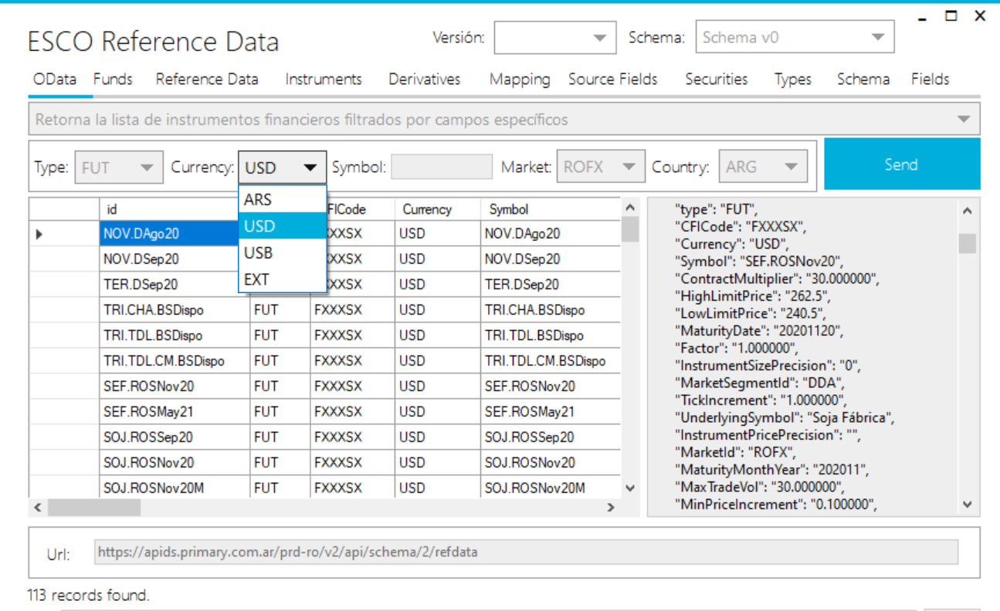

# Esco Reference Data App Tester

Aplicacion de prueba de uso de las dll del conector que se integra con el Servicio [**PMYDS - Reference Data de Primary**](https://dataservices.primary.com.ar/product/#product=reference-data-read) que ofrece información de referencia de instrumentos financieros en forma consolidada.

Se puede descargar de manera independiente:

#### PROGRAMA DE TEST

- [Descargar Instalador (.zip)](esco.reference.documentation/reference.data.zip)

#### Requerimientos

Para su utilización es necesario la solicitud de suscripción a [**PMYDS - Reference Data de Primary**](https://dataservices.primary.com.ar/product/#product=reference-data-read)

[[N|Solid](../esco.reference.documentation/05.jpg)](https://dataservices.primary.com.ar/product/#product=reference-data-read)
